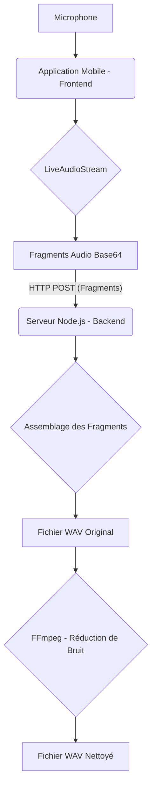

# MonProjetAudio : Streaming Audio en Temps Réel avec Traitement Backend

## Description du Projet
Ce projet implémente une application mobile (React Native avec Expo) capable de capturer un flux audio en temps réel, de l'envoyer par fragments à un backend Node.js, où il est assemblé, converti en fichier WAV, et traité pour la réduction de bruit via FFmpeg.

## Fonctionnalités
- Capture audio en temps réel depuis le microphone de l'appareil.
- Streaming des fragments audio (PCM brut encodé en Base64) vers un backend.
- Assemblage robuste des fragments audio sur le backend.
- Conversion de l'audio assemblé en fichier WAV standard.
- Réduction de bruit appliquée au fichier WAV via FFmpeg.
- **Compression de l'audio nettoyé en format Opus via FFmpeg.**
- Pipeline de traitement audio entièrement fonctionnel et testé.

## Architecture
Le projet est divisé en deux parties principales :
- **Frontend (`MonProjetAudio/`)** : Application mobile développée avec React Native et Expo, utilisant un "dev client" pour la capture audio en temps réel.
- **Backend (`backend-audio/`)** : Serveur Node.js avec Express, responsable de la réception des fragments, de l'assemblage, de la conversion WAV et du traitement audio (réduction de bruit).



## Prérequis
Assurez-vous d'avoir les éléments suivants installés sur votre machine :

1.  **Node.js et npm** : Version 18 ou supérieure recommandée.
2.  **Expo CLI** : Installez-le globalement si ce n'est pas déjà fait : `npm install -g expo-cli`
3.  **FFmpeg** : **Indispensable pour la réduction de bruit sur le backend.**
    Téléchargez et installez FFmpeg pour votre système d'exploitation depuis le site officiel : [https://ffmpeg.org/download.html](https://ffmpeg.org/download.html). Assurez-vous qu'il est accessible via votre ligne de commande (ajouté au PATH).

## Installation et Démarrage

### 1. Cloner le dépôt
```bash
git clone <URL_DU_DEPOT> # Remplacez par l'URL de votre dépôt
cd MonProjetAudio # Naviguez vers le dossier racine du projet
```

### 2. Installation des dépendances du Frontend
Naviguez dans le dossier du frontend et installez les dépendances :
```bash
cd MonProjetAudio
npm install
```

### 3. Installation des dépendances du Backend
Naviguez dans le dossier du backend et installez les dépendances :
```bash
cd backend-audio
npm install
```

### 4. Configuration de l'adresse IP du Backend
Le frontend est configuré pour envoyer les données à `http://172.20.5.0:3000`. Si l'adresse IP de votre machine (où tourne le backend) est différente, vous devrez la mettre à jour dans le fichier :
`MonProjetAudio/app/(tabs)/index.tsx`
Recherchez `const backendURL = 'http://172.20.5.0:3000/stream-chunk';` et remplacez l'IP.

### 5. Démarrage du Backend
Ouvrez un **nouveau terminal**, naviguez vers le dossier `backend-audio` et démarrez le serveur :
```bash
cd backend-audio
node server.js
```
Le serveur écoutera sur le port 3000. Vous verrez des logs indiquant la réception et le traitement des fragments.

### 6. Démarrage du Frontend (Client de Développement)
**Attention :** Cette application nécessite un "client de développement" Expo et ne fonctionnera PAS avec l'application Expo Go standard.

Naviguez vers le dossier du frontend et lancez le client de développement :
```bash
cd MonProjetAudio
npx expo run:android # Pour Android
# ou
npx expo run:ios     # Pour iOS
```
La première fois, cette commande compilera une version personnalisée de l'application, ce qui peut prendre plusieurs minutes. Les fois suivantes, ce sera plus rapide.

## Utilisation de l'Application
1.  Assurez-vous que le backend est en cours d'exécution.
2.  Lancez l'application mobile via le client de développement.
3.  Appuyez sur le bouton **"Démarrer l'écoute"**.
4.  Parlez dans le microphone de votre appareil.
5.  Appuyez sur le bouton **"Arrêter et Envoyer"**.
6.  Le backend recevra les fragments, les assemblera, créera un fichier WAV original, un fichier WAV nettoyé par FFmpeg et un fichier Opus compressé dans le dossier `backend-audio/uploads/`.

## Dépannage
*   **`SDK location not found` / Erreurs de build Android :** Assurez-vous que votre `ANDROID_HOME` est configuré ou que `sdk.dir` est correctement défini dans `MonProjetAudio/android/local.properties`.
*   **`ReferenceError: exec is not defined` :** Assurez-vous d'avoir redémarré votre serveur Node.js après les modifications du code.
*   **Fichier WAV de 0 octets :** Vérifiez les logs du backend. Si le `DEBUG: Taille du buffer binaire (PCM) après assemblage` est 0, il y a un problème avec les données reçues ou l'assemblage. Si ce n'est pas 0, mais que le fichier final est vide, vérifiez l'installation de FFmpeg ou la commande.
*   **Erreurs FFmpeg :** Vérifiez que FFmpeg est correctement installé et accessible via le PATH de votre système. Les messages d'erreur dans le terminal du backend vous donneront des indices.

## Prochaines Étapes (Non implémentées)
- Intégration d'un VAD (Voice Activity Detection) pour filtrer les silences avant l'envoi au backend.
